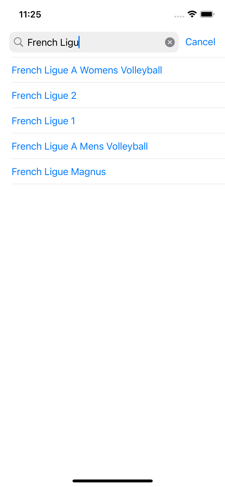
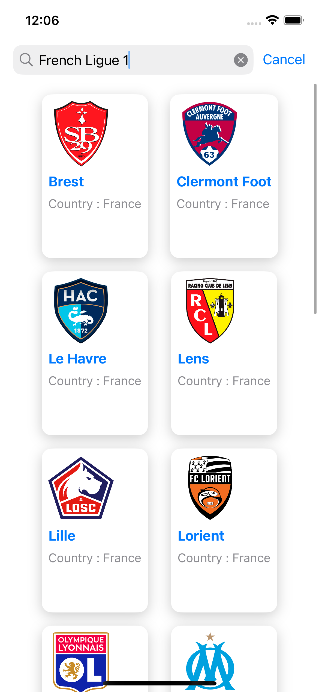
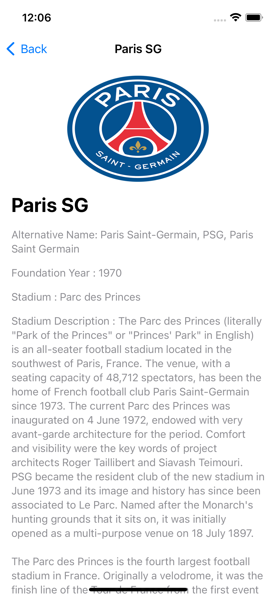

# TheSportsDBApp

Welcome to TheSportsDBApp, an amazing application for all your sports information needs! It's designed with ❤️ and brings the latest in spors information right to your fingertips. This app also features a local database created with SwiftData for a seamless offline experience.

[](https://swift.org)
[](LICENSE.md)

## Table of Contents

- [Getting Started](#getting-started)
  - [Prerequisites](#prerequisites)
  - [Installation](#installation)
- [Screenshots](#screenshots)
- [Unit Tests](#unit-tests)
- [Dependencies](#dependencies)
- [License](#license)

## Getting Started

### Prerequisites

Before you get started, ensure you have the following tools and dependencies installed:

- [XcodeGen](https://github.com/yonaskolb/XcodeGen) - Used for generating the Xcode project file.

### Installation

To set up the project, follow these steps:

1. Clone this repository:

   ```sh
   git clone https://github.com/bokri/the-sports-db-app.git
   ```

2. Navigate to the project directory:

   ```sh
   cd the-sports-db-app
   ```

3. Generate the Xcode project using XcodeGen:

   ```sh
   xcodegen generate
   ```

Now you have your Xcode project ready for development!


## Screenshots






## Unit Tests

We have a suite of unit tests that cover various aspects of the application. These tests ensure that the application functions correctly and help maintain its quality. The unit tests for this project are implemented in the Swift Package Manager (SPM) TmdbCore. We use [OHHTTPStubs](https://github.com/AliSoftware/OHHTTPStubs) for API stubbing during unit testing.

Please refer to the TsdbCore package for details on running and configuring the unit tests.

## Dependencies

TheSportsDBApp uses the following dependencies:

- [Kingfisher](https://github.com/onevcat/Kingfisher) for efficient image caching and loading.
- [OHHTTPStubs](https://github.com/AliSoftware/OHHTTPStubs) for API request stubbing during unit testing.

## License

This project is licensed under the MIT License - see the [LICENSE.md](LICENSE.md) file for details.


---

_© 2023 TheSportsDBApp_
